# АКТ ТЕСТИРОВАНИЯ № 2

## Перенос сайта заказчика dimecon.md, проверка расчётов, оформления заказов, форм и документооборота (PDF, Excel)

| | |
|---|---|
| **Объект** | Платформа LiftPortal, компания-арендатор **Dimecon 11**; источник содержимого — действующий сайт `dimecon.md` |
| **Дата испытаний** | 19.09.2026, 17:10–18:05 |
| **Стенд** | Windows 10 Pro, MySQL 8.4.0 LTS (`liftportal`, utf8mb4), Python 3.12.9, Flask 3.1.3, waitress, `http://localhost:8090` |
| **Основание** | задание заказчика: «полностью портируй и тестируй сайт заказчика и все его элементы, тестируй расчёты, оформление заказов и формы, чтобы в PDF и Excel были» |
| **Результат** | **Принято.** Содержимое сайта перенесено полностью, 138 проверок пройдены, 0 не пройдено. Выявлено и устранено 6 дефектов, зафиксировано 3 замечания по качеству данных на стороне источника |

---

## 1. Перенос содержимого сайта заказчика

### 1.1. Как выполнялся перенос

1. **Выгрузка** (`platform/tools/scrape_dimecon.py`): обход всех разделов `index.php?pag=news&tip=…` на трёх языках с учётом пагинации (`&start=`), извлечение карточек из `div#continut`, разбор таблиц ТТХ, сбор ссылок на изображения и статических страниц. Результат — `docs/dimecon_source/content.json`.
2. **Перенос** (`platform/tools/port_dimecon.py`): сопоставление карточек между языками по ключу модели, разбор характеристик, загрузка фотографий в хранилище компании, запись в базу платформы. Скрипт идемпотентный: контент пересобирается целиком, пользователи, партнёры и заявки не затрагиваются.

### 1.2. Что перенесено

| Раздел исходного сайта | Перенесено | Куда в платформе |
|---|---|---|
| Парк техники (автокраны, башенные, гусеничные) | **16 единиц** | каталог техники, категории «Автокраны» (6), «Башенные краны» (9), «Гусеничные краны» (1) |
| Транспорт (полуприцепы, тралы, самосвал) | **6 единиц** | категория «Транспорт и тралы» |
| Услуги | **14** | раздел «Услуги» с ценой «от» и моделью тарификации |
| В продаже | **5 позиций** | каталог товаров (аренда помещений, канаты, грузозахват, оборудование, запчасти) |
| О компании, Контакты | **3 страницы** | страницы сайта + профиль компании |
| Фотографии и чертежи | **57 файлов** | медиатека компании, локальное хранилище |
| Телефоны, e-mail, год основания, IDNO | перенесены | профиль: +373 22 47 35 32, +373 68 140 336, office@dimecon.md, с 1968 г. |
| Отчёты и события | **0** | раздел на источнике пуст во всех трёх языковых версиях |

Итого **22 единицы техники**, **126 строк грузовых характеристик**, тексты на RU/RO/EN.

### 1.3. Найденное на стороне источника (не дефекты платформы)

**З-1. Языковые версии каталога расходятся.** В разделе автокранов на исходном сайте: RU — 3 машины, RO — 5, EN — 4. Разные языки показывают разный парк: GROVE GMK 3055 и GMK 2035 есть только в румынской версии, KC-6471 — только в английской.

```
auto       RU= 3  RO= 5  EN= 4   <-- расходится
vinzari    RU= 5  RO= 5  EN= 4   <-- расходится
turn / senile / transport / servicii — совпадают
```

Перенос выполнен **объединением языковых версий по модели**, поэтому в платформу попал полный парк из 22 единиц, а не 3–5, как видит посетитель любой отдельной языковой версии. Для заказчика это означает, что часть парка на текущем сайте не видна значительной доле аудитории.

**З-2. У двух машин нет технических характеристик.** GROVE GMK 3055 и GMK 2035 описаны на источнике прозой («braț telescopic cu lungimea de 43 metri») без грузоподъёмности, вылета и высоты. Карточки перенесены, характеристики показаны как «—», на странице выводится явное уведомление, в подборе техники эти машины не участвуют. Требуется предоставление данных заказчиком.

**З-3. Грузовые таблицы производителя отсутствуют.** Источник публикует только паспортные максимумы (Q/R/H). Для работы подборщика построены **ориентировочные кривые** (конфигурация `approx`, консервативное занижение на 15 %), и на карточке техники выводится предупреждение: «Кривая ориентировочная… Точный подбор — по грузовой таблице производителя». Это сознательное решение: выдавать приблизительные данные под видом паспортных недопустимо.

**Две фотографии** (`image072.jpg`, `image012.jpg`) отдают на источнике HTTP 404 — битые ссылки в исходной CMS.

---

## 2. Результаты испытаний

| Группа проверок | Проверок | Пройдено | Протокол |
|---|---|---|---|
| Расчёт стоимости (построчно) | 11 | 11 | `docs/test_calc_docs.log` |
| Подбор техники и эскалации | 11 | 11 | там же |
| Калькулятор массы | 2 | 2 | там же |
| Оформление заказа и формы | 7 | 7 | там же |
| Генерация PDF | 5 | 5 | там же |
| Генерация Excel | 10 | 10 | там же |
| Разграничение доступа к документам | 4 | 4 | там же |
| Сумма прописью | 13 | 13 | `tools/test_words.py` |
| Маршруты, роли, изоляция компаний | 75 | 75 | `docs/smoke_mysql.log` |
| **Итого** | **138** | **138** | |

### 2.1. Расчёт стоимости — проверка каждой составляющей

Каждое значение сверено с независимым арифметическим расчётом из исходных ставок.

| Проверка | Ожидание | Факт |
|---|---|---|
| Сумма строк расчёта = итогу | равенство | 5 760 = 5 760 ✅ |
| Итог совпадает с ручным расчётом | 5 760 MDL | 5 760 MDL ✅ |
| НДС 20 % от нетто | 960 | 960 ✅ |
| Минимальная смена: 1 ч тарифицируется как 4 ч | равные суммы | 5 760 = 5 760 ✅ |
| Воскресный коэффициент ×1,4 | +1 440 к работе | +1 440 ✅ |
| Ночь: коэффициент ×1,5 и освещение отдельной строкой | обе строки | присутствуют ✅ |
| Зона «Регионы», 48 км: подача 2 500 + перепробег | 3 600 | 3 600 ✅ |
| Срочность (подача через 3 ч) ×1,3 | отдельная строка | присутствует ✅ |
| Скидка за гибкую дату уменьшает итог | < базового | 5 360 < 5 760 ✅ |
| Потолок коэффициента условий 1,50 | ≤ 1,50 | 1,40 ✅ |
| Потолок суммарной скидки 25 % | ≤ 25 % от подытога | 10 000 из 40 000 = 25 % ✅ |

### 2.2. Подбор техники на реальном парке заказчика

Задача: груз 3 т, высота 3 м, машина в 10 м от груза, габарит груза 6 м.

```
расчётная масса с запасом : (3 + 0,3) × 1,10 = 3,63 т          ✅ формула ТЗ
требуемая высота          : 3 + 2,5 + 3,0 + 2,0 = 10,5 м        ✅ формула ТЗ
подобрано вариантов       : 3
  KC-6471           запас  10 %   таблица 4,01 т на 18,0 м (требуется 16,6 м)  ✅
  COMANSA 10LC 140  запас  29 %   таблица 4,70 т на 20,6 м (требуется 15,8 м)  ✅
  GROVE GMK 5100    запас 276 %   таблица 13,64 т на 19,6 м (требуется 17,1 м) ✅
```

Проверено: ни один вариант не выдан с запасом ниже 10 %; вылет паспортной строки во всех случаях не меньше требуемого. Эскалация при 42 т и работе вблизи ЛЭП срабатывает (2 причины), лёгкий груз в эскалацию не уходит.

### 2.3. Оформление заказа и формы

| Сценарий | Результат |
|---|---|
| Сквозной визард из 7 шагов до результата | дошёл, варианты выданы ✅ |
| Оформление заявки | создана, номер `DIM-2026-00027` ✅ |
| Отправка формы без CSRF-токена | HTTP 400 ✅ |
| Форма обратной связи на странице контактов | принята, заявка создана ✅ |
| Форма заявки на партнёрство | принята, партнёр заведён как лид ✅ |
| Выпуск комплекта документов из карточки заявки | КП, счёт, акт созданы ✅ |
| Создание сменного рапорта (6 ч работы + 1 ч простоя по вине заказчика) | создан ✅ |

### 2.4. PDF

Генерация — fpdf2 со шрифтом DejaVu (кириллица и румынская диакритика `ș`, `ț`, `ă`, `î`).

| Документ | Размер | Проверено |
|---|---|---|
| Подтверждение заказа | 30 КБ | реквизиты, параметры выезда, расчёт, дисклеймер ✅ |
| Коммерческое предложение | 31 КБ | срок действия, построчная цена, что входит и что нет, подписи ✅ |
| Счёт на оплату | 29 КБ | реквизиты сторон, позиции, НДС, сумма прописью, условия отмены ✅ |
| Акт выполненных работ | 32 КБ | таблица смен, часы, простои, итог, подписи ✅ |
| Сменный рапорт | 27 КБ | техника, оператор, часы, простой с виной, подписи ✅ |

Текст извлечён обратно из каждого PDF и проверен: кириллица — да, диакритика — да, `Chișinău` печатается корректно.

### 2.5. Excel

| Выгрузка | Листов | Содержимое |
|---|---|---|
| Заявки | 1 | 22 колонки, фильтры, строка ИТОГО с формулами `=SUM()` ✅ |
| Сменные рапорты (табель) | 1 | часы, простои, итоги по часам и подъёмам ✅ |
| Документы и счета | 1 | суммы, оплачено, остаток, сроки ✅ |
| Парк техники | 2 | карточки + **126 строк грузовых таблиц** ✅ |
| Контакты | 1 | клиенты, источник, число заказов ✅ |
| Прайс-лист | 4 | техника, услуги, товары, коэффициенты ✅ |

Проверено чтением файлов обратно: оформленная заявка присутствует в реестре, формулы итогов на месте, прайс содержит все 4 листа.

### 2.6. Разграничение доступа к документам

| Сценарий | Ожидание | Факт |
|---|---|---|
| Аноним скачивает PDF документа | отказ | HTTP 302 на вход ✅ |
| Аноним выгружает реестр заявок | отказ | HTTP 302 ✅ |
| Аноним скачивает прайс-лист | разрешено (витрина) | HTTP 200 ✅ |
| Клиент скачивает документ по чужой заявке | отказ | HTTP 403 ✅ |

---

## 3. Скриншоты

Каталог: `docs/screens/` (65 файлов). Ниже — относящиеся к данному этапу; полный набор экранов платформы — в акте № 1.

### 3.1. Сайт заказчика до и после переноса

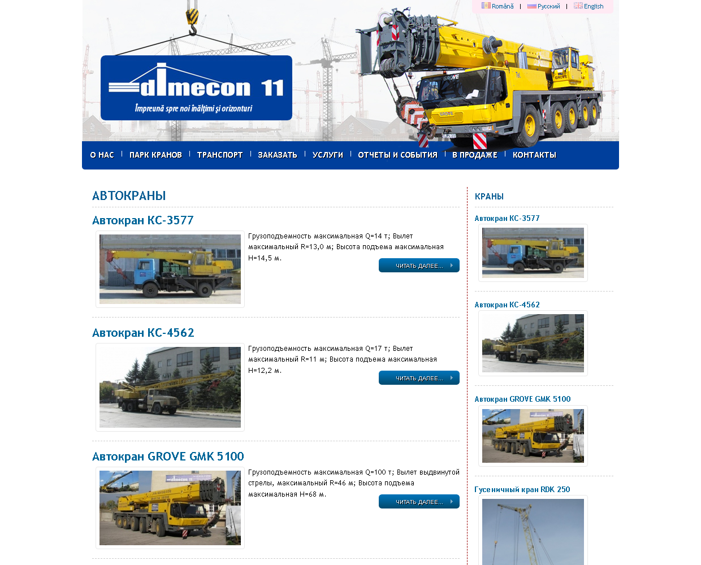
*61 — исходный сайт dimecon.md: каталог автокранов, вёрстка 2012 года, 3 машины в русской версии*

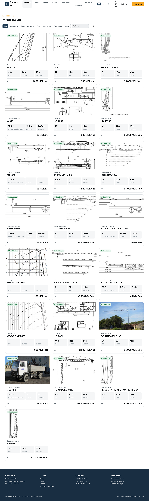
*62 — тот же парк после переноса: 22 единицы из всех языковых версий, реальные фотографии заказчика, ТТХ, ставки, доступность*

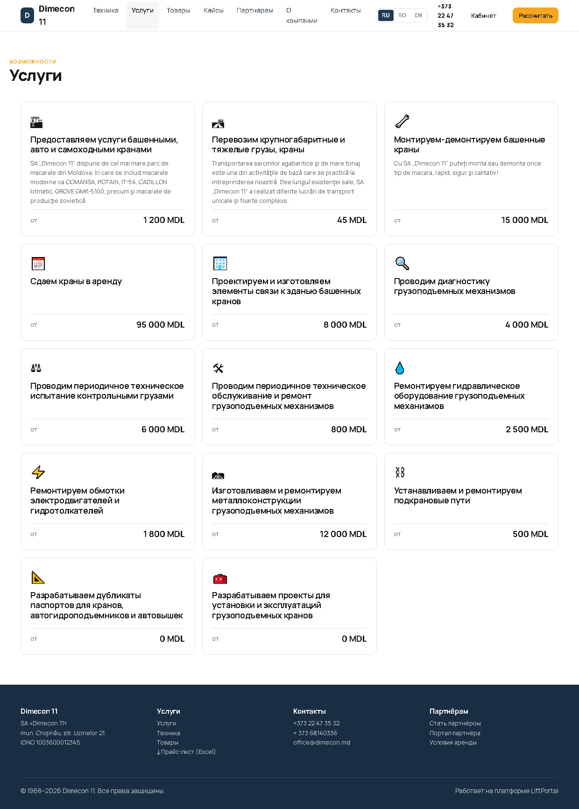
*63 — 14 услуг заказчика с ценой «от» и моделью тарификации*


*07 — карточка техники: паспортные ТТХ, таблица с исходного сайта, график грузоподъёмности с предупреждением об ориентировочных данных*

### 3.2. Расчёт и оформление заказа


*19 — результат подбора на реальном парке: варианты «Оптимально» и «С запасом», доступность, вилка цены*


*20 — «Почему эта машина» и построчная детализация стоимости*


*21 — заявка оформлена: номер, параметры, стоимость*

### 3.3. Документы PDF

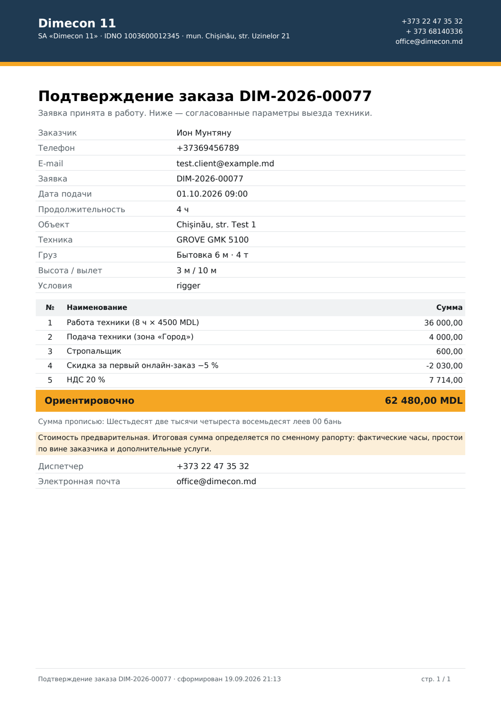
*52 — подтверждение заказа*

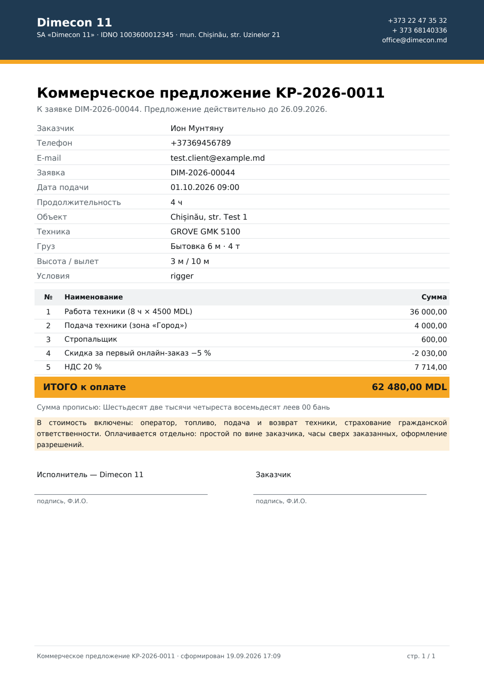
*53 — коммерческое предложение*

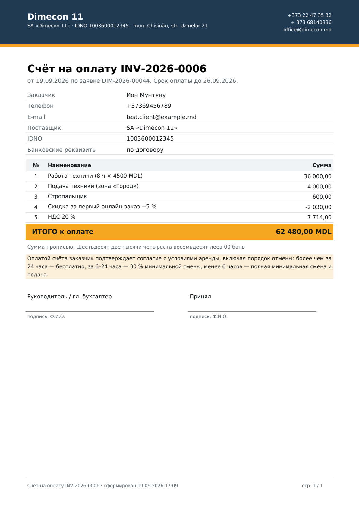
*54 — счёт на оплату: позиции, НДС, сумма прописью, условия отмены*

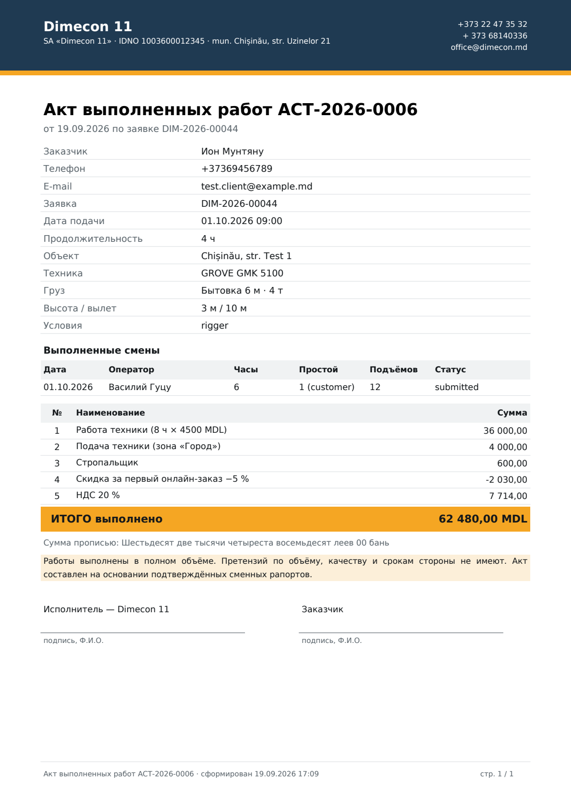
*55 — акт выполненных работ с таблицей смен*

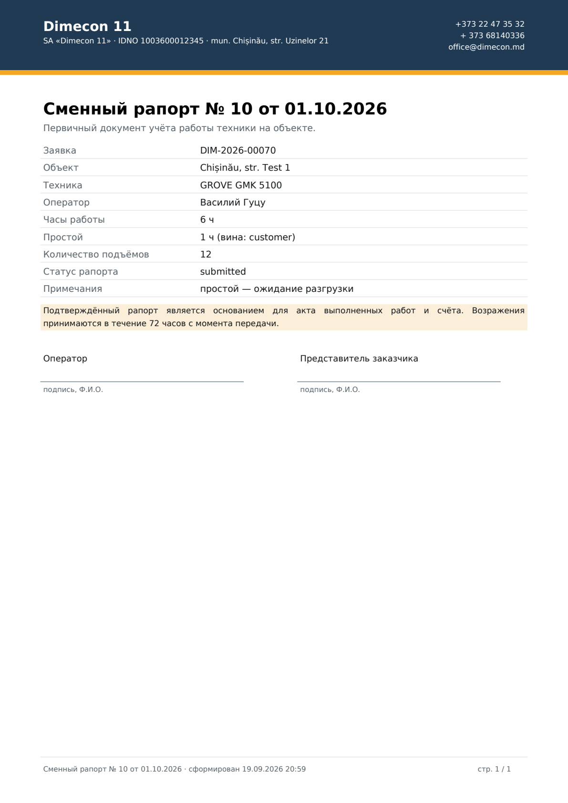
*56 — сменный рапорт: часы, простой с указанием вины, подписи*

### 3.4. Выгрузки Excel

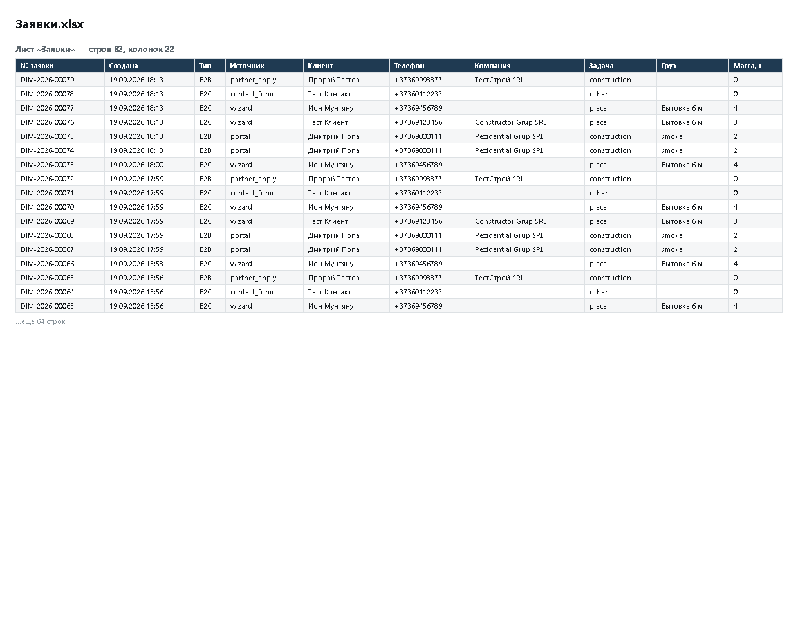
*57 — реестр заявок: 22 колонки, фильтры, итоги формулами*

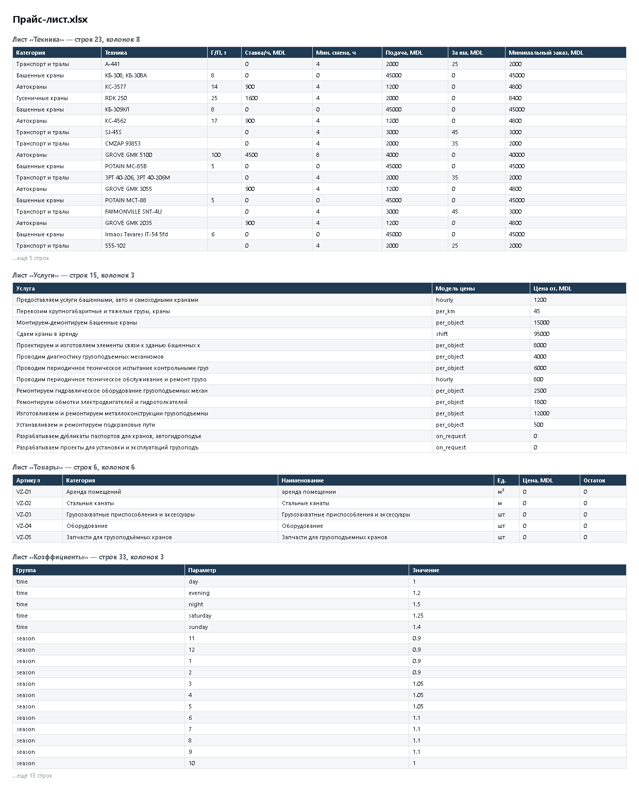
*58 — прайс-лист: техника, услуги, товары, коэффициенты — 4 листа*

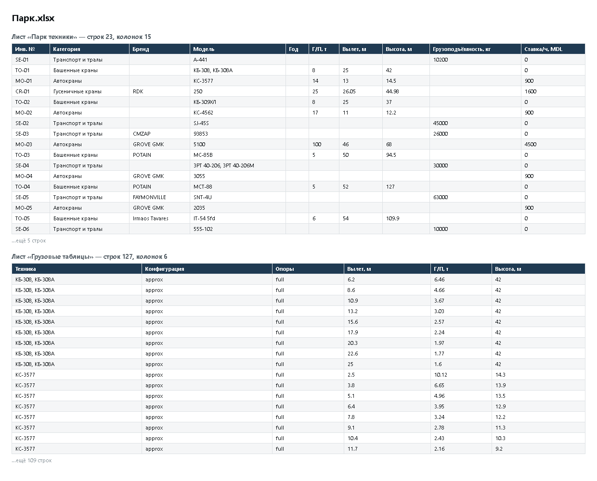
*59 — парк техники и 126 строк грузовых характеристик*

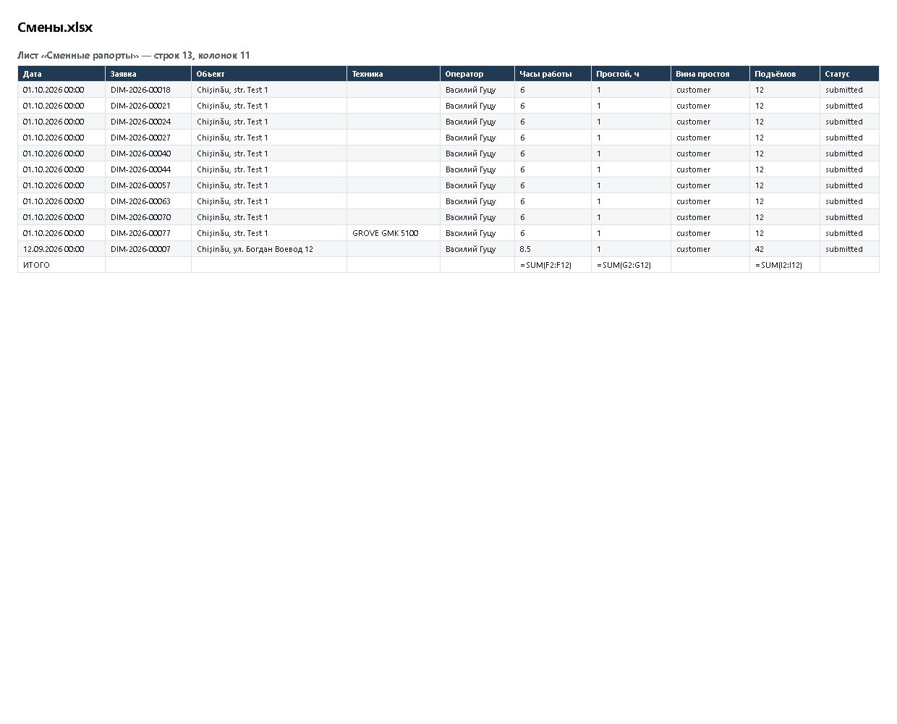
*60 — табель смен с итогами по часам и подъёмам*

---

## 4. Дефекты, выявленные и устранённые в ходе испытаний

| № | Дефект | Критичность | Как обнаружен | Исправление |
|---|---|---|---|---|
| Д-2 | **Строки скидок не соответствовали списанию.** При срабатывании потолка 25 % клиенту показывались скидки на 42 % (−7 %, −5 %, −30 %), а списывалось 25 %. Документ противоречил сам себе | высокая (финансовый документ) | автотест «потолок суммарной скидки» | доли пропорционально масштабируются, в названии строки печатается пометка «ограничено потолком 25 %»; сумма строк теперь в точности равна применённой скидке |
| Д-3 | **Шрифты PDF были повреждены.** Загрузка из репозитория вернула HTML-страницу вместо TTF, генерация падала с `bad sfntVersion` | блокирующая | автотест генерации PDF | шрифты переустановлены из CDN (757 КБ и 706 КБ, корректный `sfntVersion`), проверка загрузки добавлена в тест |
| Д-4 | **Обращение к несуществующему полю** `Document.paid_amount` ломало выгрузку документов в Excel | высокая | автотест выгрузок | оплата определяется статусом документа; фиктивное поле убрано |
| Д-5 | **В сменном рапорте печатался идентификатор техники** («Техника 65») вместо названия | средняя | чтение текста сгенерированного PDF | техника берётся из связанной заявки, печатается «GROVE GMK 5100» |
| Д-6 | **Сумма прописью печатала код валюты**: «…восемьдесят mdl 00 бань» | средняя (реквизит счёта) | визуальная проверка PDF | добавлено склонение: «леев», «лей», «лея»; покрыто 13 тестами, включая 1/2/5/11/21/102 и EUR/USD |
| Д-7 | **На обложке трёх машин стоял чертёж вместо фотографии** (кривая грузоподъёмности как главное изображение) | низкая | визуальная проверка каталога | изображения ранжируются: фотографии, названные по модели, идут перед чертежами и графиками |

Дополнительно исправлены два дефекта самих тестов (не продукта): жёстко заданные идентификаторы объектов, ломавшиеся после переноса данных, и отсутствие CSRF-токена в сценарии форм. Тесты переведены на динамический поиск объектов в базе.

---

## 5. Выводы

1. **Сайт заказчика перенесён полностью**: 22 единицы техники, 14 услуг, 5 товарных позиций, 3 страницы, 57 фотографий, контактные данные и трёхъязычные тексты. Перенос воспроизводим одной командой и не разрушает рабочие данные.
2. **Перенос выявил потерю содержимого на действующем сайте**: языковые версии показывают разный парк (3 машины в русской версии против 22 фактических). После переноса весь парк доступен на всех трёх языках.
3. **Расчёты проверены построчно** — 11 независимых сверок с ручным расчётом, включая минимальную смену, коэффициенты времени, сезона, условий, срочности, зоны подачи и оба потолка (условий и скидок).
4. **Подбор техники работает на реальном парке** заказчика с соблюдением нормативного запаса 10 % и правил эскалации.
5. **Оформление заказа и все формы работают**, защита CSRF подтверждена.
6. **Документооборот реализован**: 5 типов PDF и 6 выгрузок Excel, с корректной кириллицей, румынской диакритикой, НДС, суммой прописью и разграничением доступа.
7. Шесть дефектов, включая два потенциально финансовых, **обнаружены автотестами и устранены** в ходе испытаний.

**Для перехода к промышленной эксплуатации требуется от заказчика:**

| Что | Зачем | Без этого |
|---|---|---|
| Грузовые таблицы производителя для каждого крана | точный подбор по паспорту | подбор работает по ориентировочным кривым с предупреждением |
| ТТХ для GROVE GMK 3055 и GMK 2035 | публикация карточек | машины показаны без характеристик и не участвуют в подборе |
| Действующий прайс: ставки, минимальные смены, подача, зоны | реальные цены вместо ориентиров | расчёт показывает ориентировочные ставки по классу техники |
| Банковские реквизиты | печать в счёте | в счёте стоит «по договору» |
| Настройки SMTP компании | отправка документов клиентам | письма фиксируются в журнале и не уходят |

---

## 6. Приложения

| Приложение | Файл |
|---|---|
| Протокол расчётов, заказов, форм, PDF и Excel (50 проверок) | `docs/test_calc_docs.log` |
| Протокол маршрутов и ролей (75 проверок) | `docs/smoke_mysql.log` |
| Протокол приёмочных измерений (СУБД, производительность, API) | `docs/acceptance.log` |
| Протокол переноса | `docs/port.log`, `docs/port_report.log` |
| Проверка содержимого документов | `docs/verify_docs.log` |
| Выгруженное содержимое исходного сайта | `docs/dimecon_source/content.json` |
| **Сгенерированные документы** (5 PDF + 6 XLSX) | `docs/generated/` |
| Скриншоты (65 файлов) | `docs/screens/` |
| Акт первого этапа (MySQL, платформа) | `docs/AKT_testirovaniya.md` |

### Воспроизведение

```bash
cd platform
../.venv/Scripts/python tools/scrape_dimecon.py     # выгрузка сайта заказчика
../.venv/Scripts/python tools/port_dimecon.py       # перенос в платформу
../.venv/Scripts/python tools/test_calc_docs.py     # расчёты, заказы, формы, PDF, Excel
../.venv/Scripts/python tools/test_words.py         # сумма прописью
../.venv/Scripts/python tools/smoke.py              # маршруты, роли, изоляция
../.venv/Scripts/python tools/screenshots.py        # скриншоты интерфейса
../.venv/Scripts/python tools/screens_docs.py       # скриншоты документов и сравнение с источником
```

---

**Испытания провёл:** Claude (Claude Code), автоматизированный прогон
**Дата составления:** 19.09.2026
